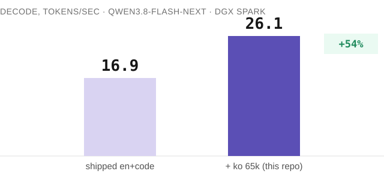

<p align="center"></p>

# mtp-draft-vocab-ko

[](LICENSE)
[](https://huggingface.co/datasets/veneta-ai/mtp-draft-vocab-ko)
[-2fd58a)](https://aclanthology.org/2025.acl-long.198.pdf)

MTP 추측 디코딩용 한국어 드래프트 어휘사전입니다. 토크나이저 가족마다 파일 하나를 한국어 위키백과로 만들고, 같은 장비에서 적용 전후를 재서 올립니다. 영어 사용자가 체감하는 LLM 답변 속도를 한국어 사용자도 누릴 수 있게 만드는 목적으로 만들었습니다.

**상태: 첫 결과 (2026-10-07).** Qwen3.8(nvidia/Qwen3.8-Flash-Next-NVFP4): 디코딩 16.9 → 26.1 tok/s(+54%), 드래프트당 수락 토큰 1.33 → 2.16, 대체 문자(U+FFFD) 0개, 한국어 스크립트 오염 0개, veneta-bench 12개 기억 능력 문항 영향 없음(12/12). 조건과 원시 실행 파일은 results/README.md에 있습니다. 아래 다른 LLM들은 아직 측정 전이며, 그 전까지 없는 내용을 주장하지 않습니다.

<p align="center"></p>

## 왜 만들나요?

MTP 헤드가 토큰 몇 개를 미리 제안하고 본 모델이 검증하는 것이 추측 디코딩입니다. FR-Spec 방식은 드래프트 헤드의 출력 투영을 빈도 상위 어휘 부분집합으로만 계산합니다. 검증은 전체 어휘로 하므로 출력은 정확히 같고 드래프트만 싸집니다. 지금 배포되는 부분집합은 영어와 코드 기준이라 한국어 토큰이 빠지고, 한국어 드래프트는 거절되어 속도가 느려집니다. MiaAI-Lab의 언어 확장 파일이 중·일·독·포·불·러·스페인어에 속도를 향상시켰고(DGX Spark 1대에서 디코드 +10~77 %), 한국어 파일은 없습니다. 이 저장소가 토크나이저 가족별로 그것을 더하고, 빌드 스크립트와 측정값을 함께 둡니다.

## 사용 (vLLM, Qwen3.8-Flash-Next, MiaAI 오버레이)

```bash
MTP_DRAFT_VOCAB=files/draft_vocab_ko_qwen3.8_en_code_65k.txt   # 비우면 기본 en+code
```

## 어떤 모델에 적용되는가

**지금 바로 쓸 수 있는 건 Qwen3.8-Flash-Next(nvidia/Qwen3.8-Flash-Next-NVFP4) 하나뿐입니다.** 나머지는 범용 vLLM 패치를 직접 만들고 있는 중이니 기다려 주세요 — GLM 5.3 Flash 등 다른 자체 MTP 헤드 가족은 검증과 측정이 남았고, Llama 3.3 70B + EAGLE-3 같은 별도 드래프터 구조는 패치가 끝나야 합니다. 아래는 왜 그런지에 대한 전체 설명입니다.

"추가 토큰을 누가 제안하는가"를 가르는 구조가 둘이고, 이 파일이 적용되는지 안 되는지를 가르는 것도 이 구조이지, 어느 회사가 만들었는지가 아닙니다.

**자체 MTP 헤드가 있는 모델은 자기 안에서 추가 토큰을 제안합니다.** 이 드래프트 헤드의 출력 투영을 어휘 부분집합으로 제한할 수 있고, 이 파일이 하는 일과 MiaAI-Lab의 오버레이가 다른 일곱 언어에서 이미 하는 일이 바로 그것입니다. Qwen3.8-Flash-Next는 측정을 마치고 공개되어 있습니다. GLM 5.3 Flash, DeepSeek V4.1 Flash, EXAONE 4.x와 다른 Qwen3.8/Qwen3-Next 체크포인트도 MTP 헤드가 있어 같은 종류의 파일을 받을 것으로 예상하지만, 아직 확인된 사실은 아닙니다. MiaAI-Lab의 오버레이는 Qwen3.8의 mtp.py를 대상으로 만들어졌고, 다른 가족의 vLLM 코드에도 같은 방식으로 붙는지는 아직 열린 확인 과제이며 사실로 공개하는 가정이 아닙니다. 이 가족들의 파일은 아직 여기에 없고, 위의 모든 숫자와 마찬가지로 주장에는 자신의 측정이 따라야 합니다.

**본 모델과 별도의 더 작은 EAGLE 방식 드래프터 모델을 함께 쓰는 구조(예: EAGLE-3을 쓰는 Llama 3.3 70B)는 지금은 이 방법을 전혀 쓸 수 없습니다.** 거기서 제한해야 할 대상은 본 모델 안의 MTP 헤드가 아니라 별도 드래프터 자신의 어휘 헤드입니다. 범용 vLLM 패치를 직접 만들어 실측까지 했는데(EAGLE-1, Llama 3.1 8B, 한국어 프롬프트 10개, 2026-10-07) — **정확성은 지켰지만 속도는 빨라지지 않았습니다**(수락률 1.55로 두 arm이 동일, 복제·대체 문자 0개로 출력은 그대로였지만, 디코딩은 15.83 → 15.57 tok/s로 오히려 잡음 수준만큼 느려짐). 이유를 코드로 확인했습니다. 로짓 마스킹은 전체 어휘로 행렬곱을 다 계산한 **뒤에** 일부만 고르는 방식이라 연산량이 전혀 줄지 않습니다. Qwen3.8의 자체 MTP 헤드가 54% 빨라진 건 행렬곱 자체가 작아지기 때문(가중치 행렬을 줄인 어휘만큼만 곱함)인데, 로짓 마스킹은 그 효과가 없습니다. 진짜 고치려면 lm_head 가중치 행렬에서 남길 어휘의 행만 모아(gather) 행렬곱 자체를 줄이고, 그 결과를 원래 어휘 id로 다시 매핑해야 합니다 — EAGLE-3이 체크포인트에 미리 구워 넣은 draft_vocab_size/d2t 매핑과 같은 발상을, 저희 빈도 목록으로 동적으로 만드는 셈입니다. 드래프터가 타깃과 lm_head 가중치를 공유하는 경우(EAGLE에서 흔함)는 공유 텐서를 직접 잘라내지 않고 항상 새 텐서로 gather해야 "타깃 검증 경로는 절대 안 건드린다"는 안전 원칙이 지켜집니다 — 이 재설계는 별도 프로젝트로 다시 시간을 들여서 할 계획입니다.

**어시스턴트 드래프터를 쓰는 Gemma 4는 위 EAGLE 경우와 다른 것으로 드러났습니다 — 2026-10-07 정정.** 같은 범용 패치가 통할 거라 가정했는데, 실제로 걸어 보니 아니었습니다. vLLM은 Gemma 4에 전용 코드 경로(Gemma4Proposer)를 따로 두고 있고, Gemma 4의 compute_logits()는 이미 masked_embedding이라는 레이어를 거칩니다 — 체크포인트 자체가 자기만의 어휘 제한 메커니즘(centroid projection과 token_ordering 버퍼)을 학습 때부터 내장하고 있다는 뜻입니다. MTP 헤드의 드래프트 어휘처럼 런타임에 파일로 바꿀 수 있는 게 아닙니다. 범용 EAGLE 패치가 애초에 건드릴 수 있는 대상이 아니었던 겁니다. 이 내장 메커니즘이 한국어를 이미 잘 다루는지, 아니면 이 저장소 전체가 고치려는 바로 그 영어 편향 문제를 똑같이 안고 있는지, 그리고 애초에 바꿀 수 있는 것인지는 완전히 별도의, 아직 답하지 않은 질문입니다 — 끝났다고 하지 않습니다. (이 구조는 veneta 자신의 통신 스택 구조라서 EAGLE 경우로 뭉뚱그리지 않고 따로 추적하고 있습니다.)

한국어 다음은 아시아·아프리카·서구권의 다른 언어들도 같은 방식으로 만들 계획입니다. 아직 측정 전이라 위의 모든 숫자와 같은 규칙을 따릅니다 — 측정되기 전에는 주장하지 않습니다.

| 가족 | 구조 | 상태 |
| --- | --- | --- |
| Qwen3.8 (Qwen3.8-Flash-Next) | 자체 MTP 헤드 | **측정 완료, 공개됨** |
| GLM 5.3 Flash · DeepSeek V4.1 Flash · EXAONE 4.x · 다른 Qwen3.8/Qwen3-Next 체크포인트 | 자체 MTP 헤드 | 될 것으로 예상, 미확인 — 파일 아직 없음 |
| Llama 3.3 70B + EAGLE-3(그 외 EAGLE 방식 스택) | 별도 드래프터 모델 | 로짓 마스킹 패치 실측(EAGLE-1): 정확함, 속도 효과 없음 — 가중치 슬라이싱으로 재설계 중 |
| Gemma 4 + 어시스턴트 드래프터 | 체크포인트에 내장된 자체 제한 방식(FR-Spec식이 아닌 centroid projection) | 파일 교체도 범용 패치 대상도 아닌 별도 질문 — 조사 중 |

## 라이선스와 크레딧

이 저장소의 모든 것은 Apache-2.0(`LICENSE`, `NOTICE`). 빈도 출처인 한국어 위키백과는 CC BY-SA 4.0이며 모든 파일 머리에 표기합니다. 방법은 FR-Spec(ACL 2025)과 MiaAI-Lab의 DGX Spark 키트를 따릅니다. 공개 파일에 고객 문서나 비공개 코퍼스는 쓰지 않습니다.

---

# mtp-draft-vocab-ko (English)

Korean draft vocabularies for MTP speculative decoding — one file per tokenizer family, built from Korean Wikipedia,
measured before and after on the same machine, so a model that answers in Korean gets the speed-up its English users
already get.

**Status: first result in (2026-10-07).** Qwen3.8 (`nvidia/Qwen3.8-Flash-Next-NVFP4`): decode 16.9 → 26.1 tok/s (+54%), draft acceptance 1.33 → 2.16 accepted/draft, zero replacement characters, zero Korean-script drift, veneta-bench's 12 memory-ability cases unaffected (12/12). Conditions and raw run files in `results/README.md`. Other families below are not yet measured; nothing is claimed before it is.

## Why

Speculative decoding with an MTP head drafts several tokens and lets the target model verify them. FR-Spec-style
trimming computes the draft head's output projection only over a frequency-ranked subset of the vocabulary; the target
still verifies over the full vocabulary, so the output is exactly the same — only the draft gets cheaper. The subsets
shipped today are ranked on English and code. Korean tokens fall outside them, Korean drafts are rejected, and
decoding slows down for Korean answers. MiaAI-Lab's language-extended files improved decode speed for zh · ja · de · pt · fr · ru · es
(+10 % to +77 % decode on one DGX Spark). There is no Korean file. This repository adds it, per tokenizer family, with
the build script and the measurements.

## What is here

| path | what |
| --- | --- |
| `files/draft_vocab_ko_<family>_65k.txt` | the vocabulary: one token id per line, 65,536 rows — the family's shipped floor, all byte-fallback ids pinned, then ids by Korean frequency |
| `scripts/` | the standalone build script (input: a tokenizer, a Korean corpus, the floor file; output: the 65k file) and the measurement harness |
| `results/` | the measurement protocol and the before/after table, with every condition |

## How to use (vLLM, Qwen3.8-Flash-Next, MiaAI overlay)

```bash
MTP_DRAFT_VOCAB=files/draft_vocab_ko_qwen3.8_en_code_65k.txt   # empty = the shipped en+code default
```

Other engines and families are added as they are measured; see `results/README.md`.

## Which models this applies to

**Qwen3.8-Flash-Next (`nvidia/Qwen3.8-Flash-Next-NVFP4`) is the only model that works today.** Everything else is
waiting on a generic vLLM patch we're building — other built-in-MTP-head families (GLM 5.3 Flash, etc.) still need
their own verification and measurement, separate-drafter stacks (Llama 3.3 70B + EAGLE-3) need the patch itself. The
rest of this section explains why.

Two different architectures answer "what drafts the extra tokens", and that is what decides whether a file like this
one can even apply, not which company trained the model.

**A model with a built-in MTP head drafts its own extra tokens.** Its draft head's output projection can be restricted
to a subset of the vocabulary — that is what this file does, and what MiaAI-Lab's overlay already does for seven other
languages. Qwen3.8-Flash-Next is measured and public. GLM 5.3 Flash, DeepSeek V4.1 Flash, EXAONE 4.x and other
Qwen3.8/Qwen3-Next checkpoints also have an MTP head and are **expected to take the same kind of file**, but that is
not yet verified — MiaAI-Lab's overlay was built against Qwen3.8's `mtp.py`, and whether it attaches the same way to
each other family's own vLLM code is an open check, not an assumption we are publishing as fact. No file for those
families exists here yet; a claim awaits its own measurement, same as every number above.

**A model that pairs a full-size target with a separate, smaller EAGLE-style drafter model (e.g. Llama 3.3 70B with
EAGLE-3) cannot use this method at all today.** The thing to restrict there is the separate drafter's own vocabulary
head, not an MTP head inside the target. We built a generic vLLM patch for that and measured it (EAGLE-1, Llama 3.1
8B, 10 Korean prompts, 2026-10-07) — **correctness held, but there was no speedup** (acceptance 1.55 identical in both
arms, zero replacement/garbled characters either way, but decode went 15.83 → 15.57 tok/s, noise-level but in the
wrong direction). We read the actual running code to find out why: masking logits happens *after* the full-vocabulary
matmul already ran, so it cuts zero FLOPs — unlike Qwen3.8's native MTP head, where the +54% above comes from the
weight matrix itself shrinking before the matmul. The real fix is to gather only the kept-vocabulary rows out of
`lm_head`'s weight matrix before the matmul, shrinking the GEMM itself, then map the reduced argmax index back to the
true vocabulary id — the same idea as EAGLE-3's own baked-in `draft_vocab_size`/`d2t` remapping, built dynamically from
a frequency list instead of trained into the checkpoint. Where a drafter shares `lm_head` weights with its target (common for
EAGLE), the kept rows must be gathered into a fresh tensor, never sliced from the shared one in place, to keep the
"target verification path stays untouched" safety property. That redesign is its own project, not yet started.

**Gemma 4 with an assistant drafter turned out not to be the EAGLE case above — correction, 2026-10-07.** We assumed
it needed the same generic patch; trying the patch against it showed otherwise. vLLM gives Gemma 4 its own dedicated
code path (`Gemma4Proposer`), and Gemma 4's `compute_logits()` already routes through a `masked_embedding` layer —
the checkpoint carries its *own* vocabulary-restriction mechanism (a centroid projection and a `token_ordering`
buffer), baked in at training time, not a runtime file the way an MTP head's draft vocab is. A generic EAGLE patch
was never going to touch it. Whether that built-in mechanism already covers Korean adequately, or has the same
English-bias gap this whole repository exists to fix, and whether it can be swapped at all, is a separate, open
question — not yet answered, not yet being called close. (This is VENETA's own telecom stack's architecture, which is
why we are tracking it specifically rather than treating the EAGLE case as covering it.)

After Korean, other languages across Asia, Africa and the West are planned on the same recipe. Not yet measured, same
rule as every number above — nothing claimed before it is.

| family | architecture | status |
| --- | --- | --- |
| Qwen3.8 (Qwen3.8-Flash-Next) | built-in MTP head | **measured, public** |
| GLM 5.3 Flash · DeepSeek V4.1 Flash · EXAONE 4.x · other Qwen3.8/Qwen3-Next checkpoints | built-in MTP head | expected to work, unverified — no file yet |
| Llama 3.3 70B + EAGLE-3 (and other EAGLE-style stacks) | separate drafter model | logit-masking patch measured (EAGLE-1): correct, no speedup — redesigning as weight-matrix slicing |
| Gemma 4 + assistant drafter | its own checkpoint-baked restriction (centroid projection, not FR-Spec-style) | open question, not a file-swap or a generic-patch target — under investigation |

## Licence and credit

Apache-2.0 for everything in this repository (see `LICENSE`, `NOTICE`). Korean Wikipedia is the frequency source,
CC BY-SA 4.0, attributed in every file header. The method follows FR-Spec (ACL 2025) and MiaAI-Lab's DGX Spark kits.
No customer or private corpus is used in any published file.
